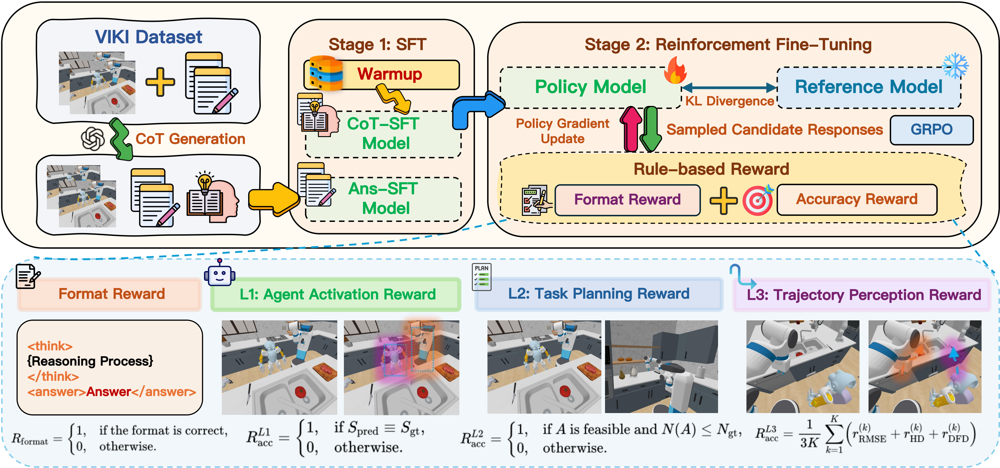

<div align="center">
  
  <h1 align="center">VIKI-R: Coordinating Embodied Multi-Agent Cooperation via Reinforcement Learning</h1>
  <a href="https://arxiv.org/abs/2506.09049"></a>
  <a href="https://faceong.github.io/VIKI-R/"></a>
  <a href='https://huggingface.co/datasets/henggg/VIKI-R'></a>
</div>
  
## 🔥 Overview <a name="overview"></a>
<div align="center">
  
</div>

**VIKI** comprises **VIKI-Bench** (a hierarchical multi-agent visual reasoning benchmark) and **VIKI-R** (a two-stage learning framework).  
- **VIKI-Bench** introduces a three-level evaluation suite—**Agent Activation**, **Task Planning**, **Trajectory Perception**—with 23,737 tasks across 100 scenes, 6 robot morphologies, and over 1,000 asset combinations, offering both global and first-person views.
- **VIKI-R** builds on **Qwen2.5-VL-Instruct** (3B/7B) via:  
  1. **Supervised Fine-Tuning (SFT)** with high quality Chain-of-Thought (CoT) annotations.
  2. **Reinforcement Fine-Tuning (RFT)** using Grouped Relative Policy Optimization (GRPO) and combined diverse rewards.
     
## 🎯 Key Features

- **Hierarchical Dataset**: 23,737 tasks, 100 scenes, 6 robot types, ≥1,000 asset combos. 
- **GRPO RL**: Structured planning with dual-format and correctness rewards.
- **Robotic-Focused**: Home layouts, varied embodied multi-agent tasks.
- **Metrics**: Activation Accuracy, Planning Correctness & Efficiency, Trajectory RMSE/HD/DFD.

## 📊 Datasets <a name="datasets"></a>
<div align="center">
  
</div>

### VIKI-Bench Levels  
- **Level 1: Agent Activation**  
  Select the appropriate subset of agents given a scene and instruction.
- **Level 2: Task Planning**  
  Generate executable multi-agent action sequences within reference length.
- **Level 3: Trajectory Perception**  
  Predict spatial trajectories of visible agents from first-person views; evaluate via RMSE, Hausdorff, and Dynamic Fréchet Distance.

**Statistics:**  
- **23,737** task samples  
- **100** diverse 3D scenes  
- **6** heterogeneous robot morphologies (e.g., dual-arm, tracked, legged, humanoid)  
- **>1,000** asset combinations  
- Global view + multi ego-perspectives  

## 🚀 Quick Start <a name="quick-start"></a>

### 🔧 Environment Setup

```bash
# Clone repository
git clone https://github.com/MARS-EAI/VIKI-R.git
cd VIKI-R

# Create Conda environment
conda env create -f roboviki.yml
conda activate roboviki
```

### 📦 Framework Installation

```bash
# Install verl framework
cd verl
pip install --no-deps -e .
cd ..

# Install FlashAttention (download wheel from: https://github.com/Dao-AILab/flash-attention)
pip install flash_attn-2.7.4.post1+cu12torch2.6cxx11abiFALSE-cp310-cp310-linux_x86_64.whl
```

### 📥 Data Preparation

```bash
# Download VIKI-R dataset from Hugging Face
git clone https://huggingface.co/datasets/henggg/VIKI-R
```

### 🏋️ Training

#### Step 1: Supervised Fine-Tuning (SFT)

```bash
# Prepare LLaMA-Factory environment
# Use https://github.com/hiyouga/LLaMA-Factory and put the CoT data in llamafactory's dataset_info.json

# Train 3B model with SFT
llamafactory-cli train configs/viki-1-3b.yaml
```

#### Step 2: Reinforcement Learning with GRPO

```bash
# Navigate to GRPO training directory
cd train/3BGRPO/VIKI-L1

# Initialize VIKI-R-zero training
bash VIKI-R-zero.sh

# Start VIKI-R
bash VIKI-R.sh
```

### 🎯 Evaluation

```bash
# Navigate to evaluation directory
cd VIKI-R/eval

# Evaluate on Level 1: Agent Activation
cd VIKI-L1
python qwen.py

# Evaluate on Level 2: Task Planning  
cd ../VIKI-L2
python qwen.py

# Evaluate on Level 3: Trajectory Perception
cd ../VIKI-L3
python qwen.py

# Alternative: Use answer generation script for each level
cd ../VIKI-L1
python qwen_ans.py

cd ../VIKI-L2  
python qwen_ans.py

cd ../VIKI-L3
python qwen_ans.py

# Evaluation with feedback (if available)
cd ../eval_with_fb
python gpt4o.py
```

### 📊 Evaluation Metrics

- **Level 1 (Agent Activation)**: Activation Accuracy
- **Level 2 (Task Planning)**: Planning Correctness & Efficiency
- **Level 3 (Trajectory Perception)**: RMSE, Hausdorff Distance, Dynamic Fréchet Distance


## 🗂️ Model Zoo <a name="model-zoo"></a>

| Model Size | Levels Supported | Training Stages   | Download           | Status      |
|------------|------------------|-------------------|--------------------|-------------|
| 3B         | L1 / L2 / L3     | SFT + GRPO        | [viki-3b](./models/) | Coming Soon |
| 7B         | L1 / L2 / L3     | SFT + GRPO        | [viki-7b](./models/) | Coming Soon |

## 📑 Citation <a name="citation"></a>

If our work is helpful to you, please consider citing our work!

```bibtex
@article{kang2025viki,
  title={VIKI-R: Coordinating Embodied Multi-Agent Cooperation via Reinforcement Learning},
  author={Kang, Li and Song, Xiufeng and Zhou, Heng and Qin, Yiran and Yang, Jie and Liu, Xiaohong and Torr, Philip and Bai, Lei and Yin, Zhenfei},
  journal={arXiv preprint arXiv:2506.09049},
  year={2025}
}
```
```bibtex
@article{qin2025robofactory,
  title={RoboFactory: Exploring Embodied Agent Collaboration with Compositional Constraints},
  author={Qin, Yiran and Kang, Li and Song, Xiufeng and Yin, Zhenfei and Liu, Xiaohong and Liu, Xihui and Zhang, Ruimao and Bai, Lei},
  journal={arXiv preprint arXiv:2503.16408},
  year={2025}
}
```
